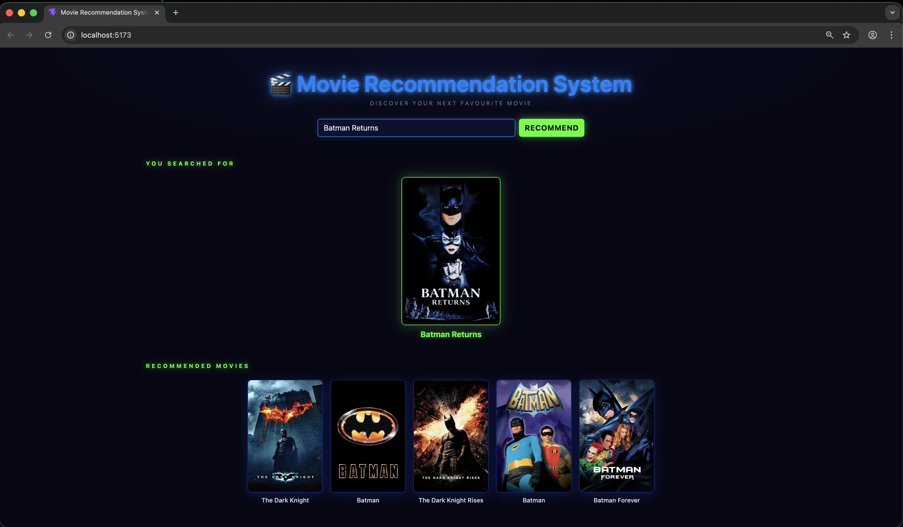

# 🎬 Movie Recommendation System

A content-based movie recommendation engine built with Python and React — type a movie name and instantly get 5 similar recommendations with posters.

---

## 📸 Screenshot



---

## 🧠 How It Works

The recommender uses **content-based filtering**:

1. Movie metadata (overview, genres, keywords, cast, director) is combined into a single "tags" string per movie
2. Text is stemmed using **NLTK PorterStemmer** and vectorised using **CountVectorizer** (top 5000 words)
3. **Cosine similarity** is computed between all movie vectors
4. For any searched movie, the 5 most similar movies are returned

---

## 🗂️ Project Structure

```
MovieRecommenderSystem/
│
├── datasets/
│   ├── tmdb_5000_movies.csv
│   └── tmdb_5000_credits.csv
│
├── frontend/                   # React + Vite frontend
│   ├── src/
│   │   ├── components/
│   │   │   └── MovieCard.jsx
│   │   ├── App.jsx
│   │   ├── theme.css
│   │   ├── index.css
│   │   └── main.jsx
│   ├── .env.example
│   └── package.json
│
├── dataset.ipynb               # Data exploration & model prototyping
├── system.py                   # FastAPI backend
├── requirements.txt
└── .gitignore
```

---

## 🛠️ Tech Stack

| Layer | Technology |
|---|---|
| Data & ML | Python, Pandas, NumPy, scikit-learn, NLTK |
| Backend | FastAPI, Uvicorn |
| Frontend | React 18, Vite, Bootstrap 5, Axios |
| Movie Posters | TMDB API |
| Dataset | TMDB 5000 Movies Dataset |

---

## ⚙️ Setup & Installation

### Prerequisites
- Python 3.12+
- Node.js 18+

### 1. Clone the repository

```bash
git clone https://github.com/ml-guppy-lab/movie-recommendation-system.git
cd movie-recommendation-system
```

### 2. Set up Python environment

```bash
python3 -m venv .venv
.venv/bin/python3 -m pip install --upgrade pip
.venv/bin/python3 -m pip install -r requirements.txt
```

### 3. Set up the frontend

```bash
cd frontend
npm install
cp .env.example .env
```

Open `frontend/.env` and add your [TMDB API key](https://www.themoviedb.org/settings/api):

```env
VITE_BACKEND_URL=http://localhost:8000
VITE_TMDB_API_KEY=your_tmdb_api_key_here
```

---

## 🚀 Running the App

You need **two terminals** open simultaneously:

**Terminal 1 — Backend:**
```bash
.venv/bin/python3 system.py
```

**Terminal 2 — Frontend:**
```bash
cd frontend && npm run dev
```

Then open **http://localhost:5173** in your browser.

> The backend must be running before you search, otherwise the frontend will show an error.

---

## 🔌 API Endpoints

| Method | Endpoint | Description |
|---|---|---|
| `GET` | `/movies` | Returns all available movie titles |
| `GET` | `/recommend?movie=Avatar` | Returns 5 recommendations for a movie |

Interactive API docs available at **http://localhost:8000/docs**

---

## ✨ Features

- 🔍 **Autocomplete search** — suggestions from the full dataset as you type
- 🎴 **Movie posters** — fetched live from TMDB
- ⌨️ **Keyboard navigation** — arrow keys + Enter to select suggestions
- 📱 **Responsive layout** — works on mobile and desktop
- ⚡ **Fast** — cosine similarity computed at startup, recommendations served instantly

---

## 📊 Dataset

[TMDB 5000 Movie Dataset](https://www.kaggle.com/datasets/tmdb/tmdb-movie-metadata) — contains metadata for ~5000 movies including genres, keywords, cast, crew, and overviews.

---

## 🤝 Connect

Built by **Sonal Kumari** — follow for more ML projects and tutorials:

[](https://www.instagram.com/themlguppy/)
